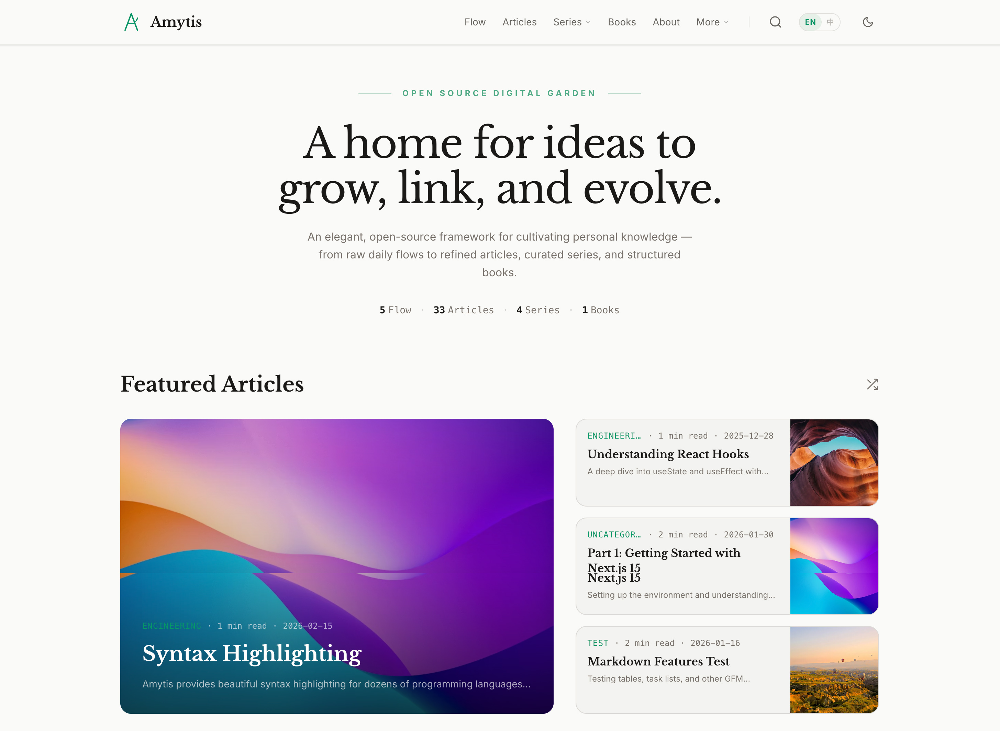

# Amytis

[English](README.md) | [简体中文](README.zh.md)

**Amytis** is an elegant, open-source framework for building a personal digital garden: a living knowledge space where ideas grow from raw notes to refined writing. It is built with Next.js 16, React 19, and Tailwind CSS v4, with a strong focus on readability, structure, and long-term content ownership.

[**Live Demo**](https://amytis.vercel.app/)



## The Knowledge Ladder

Amytis is built around a simple path from rough to refined:

- **Flow**: Capture raw daily thoughts and fragments.
- **Articles**: Refine one idea into a clear essay.
- **Series**: Connect related articles into a curated narrative.
- **Books**: Distill mature knowledge into structured chapters and parts.

Each stage builds on the previous one, so your garden can evolve naturally.

## Features

- **Digital Garden Philosophy:** Non-linear navigation through tags, series, authors, books, flows, and chronological archives.
- **Interconnected Knowledge:**
  - **Wiki-links:** Bidirectional linking (`[[Slug]]`) between all content types.
  - **Backlinks:** Automatic "Linked References" display on notes.
  - **Knowledge Graph:** Interactive visual map of your content connections.
- **Full-text Search:** Fast, static client-side search across all content (Cmd/Ctrl+K) powered by Pagefind.
- **Structured Content:**
  - **Series:** Multi-part content organization with manual or automatic ordering.
  - **Books:** Long-form content with explicit chapters, parts, and a dedicated reading interface.
  - **Notes:** Atomic, evergreen concepts for personal knowledge management.
  - **Flows:** Stream-style daily notes or micro-blogging for quick thoughts.
- **Rich MDX Content:**
  - GitHub Flavored Markdown (tables, task lists, strikethrough).
  - Syntax-highlighted code blocks.
  - Mermaid diagrams (flowcharts, sequence diagrams, etc.).
  - LaTeX math via KaTeX.
  - Raw HTML support for custom layouts.
- **Elegant Design:**
  - Minimalist aesthetic with high-contrast typography.
  - Light/Dark mode with automatic system detection.
  - Four color palettes: default (emerald), blue, rose, amber.
  - Responsive layout optimized for reading.
  - Horizontal scrolling for featured content on the homepage.
- **Table of Contents:** Sticky TOC with scroll tracking, reading progress indicator, and active heading highlight.
- **Flexible Content Structure:**
  - Flat files (`post.mdx`) or nested folders (`post/index.mdx`).
  - Co-located assets: keep images inside post folders (`./images/`).
  - Date-prefixed filenames: `2026-01-01-my-post.mdx`.
  - Draft support for posts, series, books, and flows.
- **Author Ecosystem:** Per-author profile pages with bio, avatar, and social links. Posts are filterable by author; an optional author card appears at the end of each post.
- **Performance & SEO:**
  - Fully static export with optimized WebP images.
  - Open Graph and Twitter card metadata for every content type.
  - JSON-LD structured data (`BlogPosting`, `Book`, `Article`) for Google rich results.
  - RSS/Atom feed with configurable format (`rss` | `atom` | `both`) and content depth (`full` | `excerpt`).
  - Feed auto-discovery links in `<head>`, native sitemap generation.
  - Multilingual reading time estimate (supports Latin and CJK).
- **Integrations:**
  - Analytics: Umami, Plausible, or Google Analytics.
  - Comments: Giscus (GitHub Discussions) or Disqus.
  - Internationalization: multi-language support (en, zh) with localized `site.config.ts`.
- **Content CLI Tools:** Create posts, series, and import from PDFs or image folders.
- **Modern Stack:** Next.js 16, React 19, Tailwind CSS v4, TypeScript 5, Bun.

## Design Philosophy

- **Elegance by default**: Typography, spacing, and color should feel intentional out of the box.
- **Content over configuration**: Writing and publishing should be simple file-based workflows, not CMS-heavy setup.
- **Markdown-first, not markdown-limited**: Keep authoring portable while supporting rich output (math, diagrams, code, wikilinks).
- **Ship what you need**: Features are modular through `site.config.ts`; disable sections you do not use.
- **Plain text, long-term ownership**: Content stays in Markdown/MDX so it remains versionable and portable.

## Quick Start

### New Project (Recommended)

Scaffold a new Amytis site with one command:

```bash
bun create amytis my-garden
cd my-garden
bun dev
```

The scaffold command downloads the latest tagged Amytis release, installs dependencies, and patches `site.config.ts` and `package.json` with your project metadata.

### Clone & Run

1. **Install Dependencies:**
   ```bash
   bun install
   ```

2. **Start Development Server:**
   ```bash
   bun dev
   ```
   Visit [http://localhost:3000](http://localhost:3000).

   > **Search in dev:** the Pagefind index is generated during `bun run build:dev`. Run it once before testing Cmd/Ctrl+K locally, and re-run it after content changes.

3. **Build for Production (Static Export):**
   ```bash
   bun run build
   ```
   The static site will be generated in the `out/` directory with optimized images.

4. **Development Build (faster, no image optimization):**
   ```bash
   bun run build:dev
   ```

## CLI Commands

```bash
## Core
bun dev
bun run lint
bun run build:graph
bun run validate

## Build & Deploy
bun run build
bun run build:dev
bun run clean
bun run deploy                 # Deploy to Linux/nginx server (requires .env.local)

## Test
bun test
bun run test:unit
bun run test:int
bun run test:e2e
bun run test:mobile

## Create Content
bun run new "Post Title"
bun run new-weekly "Weekly Topic"
bun run new-series "Series Name"
bun run new-note "Concept"
bun run new-flow

## Import / Maintain
bun run new-from-pdf ./doc.pdf
bun run new-from-images ./photos
bun run new-flow-from-chat
bun run import-obsidian
bun run import-book
bun run sync-book
bun run series-draft "series-slug"
bun run add-series-redirects --dry-run
```

### Importing Chat Logs to Flows

Drop `.txt` or `.log` files into `imports/chats/`, then run:

```bash
bun run new-flow-from-chat
```

Common flags: `--all`, `--dry-run`, `--author "Name"`, `--append`, `--timestamp`.
Import history is stored in `imports/chats/.imported`.

## Configuration

Primary site settings live in `site.config.ts`. `site.config.example.ts` is the reference template used by the scaffold and is useful when reviewing new options:

```typescript
export const siteConfig = {
  // ...
  nav: [
    { name: "Home", url: "/", weight: 1 },
    { name: "Flow", url: "/flows", weight: 1.1 }, // Add Flows to nav
    { name: "Series", url: "/series", weight: 1.5 },
    { name: "Books", url: "/books", weight: 1.7 },
    { name: "Archive", url: "/archive", weight: 2 },
    // ...
  ],
  // ...
  flows: {
    recentCount: 5,
  },
};
```

High-impact areas to customize first:

- Site identity: `title`, `description`, `baseUrl`, `ogImage`, `logo`
- Navigation and footer: `nav`, `footer`, `subscribe`, `social`
- Content behavior: `posts.basePath`, `posts.includeDateInUrl`, `series.autoPaths`, `series.customPaths`
- Homepage composition: `hero`, `homepage.sections`
- Integrations: `analytics`, `comments`, `feed`, `i18n`

For static hosting behind nginx, start from `nginx.conf.example`.

## Static Export Routing Rules

Amytis is built around Next.js static export with `output: "export"` and `trailingSlash: true`.

- In `generateStaticParams()`, return raw segment values. Do not pre-encode with `encodeURIComponent`.
- Link to concrete URLs such as `/posts/中文测试文章`, not route placeholders like `/posts/[slug]`.
- Posts default to `/<posts.basePath>/<slug>` and `posts.basePath` defaults to `/posts`.
- If `series.autoPaths` is enabled, series posts move to `/<series-slug>/<post-slug>`.
- If `series.customPaths` is configured, those custom prefixes override `autoPaths`.
- Before moving series posts off the default posts path, run `bun run add-series-redirects --dry-run` and then `bun run add-series-redirects` so legacy URLs still resolve.

## Writing Content

### Posts

Create `.md` or `.mdx` files in `content/posts/`.

- Flat file: `content/posts/my-post.mdx`
- Date-prefixed file: `content/posts/2026-01-01-my-post.mdx`
- Folder post with co-located media: `content/posts/my-post/index.mdx` plus `content/posts/my-post/images/*`
- CLI: `bun run new "Post Title"` or `bun run new "Post Title" --folder`

### Flows

Create daily notes in `content/flows/YYYY/MM/DD.md` or `.mdx`.

- CLI: `bun run new-flow` creates today’s entry
- Chat import: put exports in `imports/chats/` and run `bun run new-flow-from-chat`

### Series

Create a directory in `content/series/<slug>/` with an `index.mdx`, then add posts as sibling files or folders.

- CLI: `bun run new-series "Series Name"`
- You can also create a post directly inside an existing series with `bun run new "Post Title" --series <series-slug>`

### Books

Books are long-form structured content under `content/books/<slug>/`.

- Keep book metadata in `index.mdx`
- Add chapter files beside it, for example `introduction.mdx` or `setup.mdx`
- Use `bun run import-book` and `bun run sync-book` for book-oriented workflows

### Notes

Create evergreen notes in `content/notes/` (for example `concept.mdx`). Use `[[wiki-links]]` to connect them.

- CLI: `bun run new-note "Concept"`
- Unicode slugs are supported intentionally for notes and posts where needed

## Project Structure

```
amytis/
  content/
    posts/              # Blog posts
    series/             # Series collections
    books/              # Long-form books
    notes/              # Digital garden notes
    flows/              # Daily notes (YYYY/MM/DD)
    about.mdx           # Static pages
  docs/                 # Architecture, deployment, troubleshooting
  imports/              # Local-only input files for import scripts
  public/               # Static assets
  scripts/              # Bun authoring/build/import tooling
  src/
    app/                # Next.js App Router pages
      books/            # Book routes
      notes/            # Note routes
      graph/            # Knowledge graph
      flows/            # Flow routes
    components/         # React components
    lib/
      markdown.ts       # Data access layer
  tests/                # Unit, integration, e2e, tooling tests
  packages/
    create-amytis/      # `bun create amytis` scaffold CLI
  site.config.ts        # Site configuration
```

## Documentation

- [Architecture Overview](docs/ARCHITECTURE.md)
- [Deployment Guide](docs/deployment.md)
- [Digital Garden Guide](docs/DIGITAL_GARDEN.md)
- [Contributing Guide](docs/CONTRIBUTING.md)
- [Troubleshooting](docs/TROUBLESHOOTING.md)

## License

MIT
